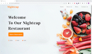

# restaurant-reservation
A restaurant website where a guest can make a reservation for a table and an admin dashboard that can see all reservations and control tables, menus, and categories.




# Basic Features:
* Reserve a table
* Control reservations
* Control menus
* Control tables
* Control food categories

# Techbologies
* PHP
* Laravel
* Bootstrap
* MySQL
* JavaScript

# Installation

Download this repo.

Rename ```.env.example``` to ```.env``` and fill the options.

Run the following commands:
```
composer install
php artisan key:generate
php artisan migrate
php artisan serve
```
